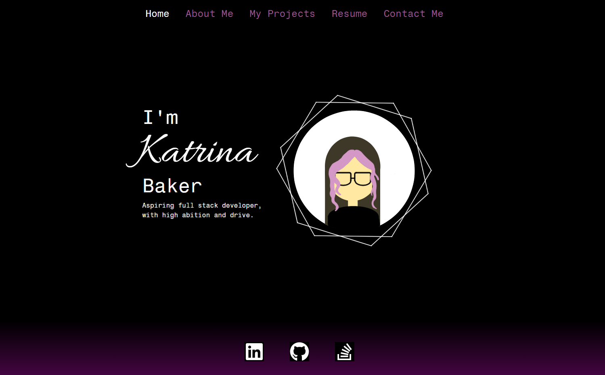

# React Portfolio

    <a href="https://github.com/katbakr/React-Portfolio">Report Bug</a>
    ·
    <a href="https://github.com/katbakr/React-Portfolio">Request A Change</a>
  

  
  ## Table of Contents
  * [Description](#description)
  * [Installation](#installation)
  * [License](#license)
  * [Contributing](#contributing)
  * [Questions](#questions)

  ## Description
 A portfolio made using only React, to display my best projects and the skills I have aquired with using React.

 Not currently deployed because I can't figure out gh-pages.

  ## Installation
### For Devs
If you would like to view my code you can clone it locally using the git clone command.

  ### For User
This application can be initially accessed at the gh-pages that will be provided in the future.

## License
See MIT Liscense for information. 

  ## Contributing
  Please feel free to use the report a bug and request a feature buttons at the top of this README to help develop and improve this application.

  ## Questions
  If you have an questions about this project please reach out using my contacts below!
  
  GitHub: https://github.com/katbakr

  Email: katrinamourine@gmail.com

